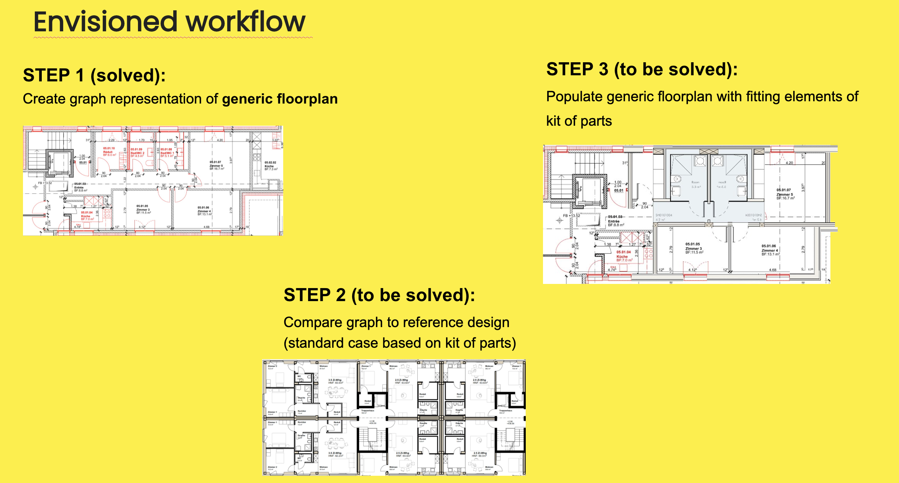

# 2025-AEC Hackathon

## Pattern Recognition with Graph Databases for Industrialized Construction

### Background
Implenia develops a system for the industrialized construction of housing projects. This system is based on a **Reference Design**: a flexible floorplan that can be stretched and adapted to different environments. The components of the system, known as the **Kit-of-Parts**, are predefined modular elements ("lego blocks") that can be combined to create a variety of configurations. These predefined components enable faster, more efficient construction while maintaining flexibility and adaptability.

### Problem
Let’s suppose we start from a random design that was not developed for industrialized construction. The challenge is: 

**How can we apply a kit-of-parts logic to any floorplan?**

This requires the ability to analyze, compare, and adapt arbitrary floorplans to align with the principles of industrialized construction, leveraging the Kit-of-Parts system.

### Envisioned Workflow
The envisioned workflow for addressing this challenge consists of three steps:

#### Step 1 (solved): Create Graph Representation of Generic Floorplan
A graph representation is generated for any generic floorplan, capturing spatial relationships and structural elements. This allows for a computational analysis of the design.

#### Step 2 (to be solved): Compare Graph to Reference Design
The graph representation of the generic floorplan is compared to a reference design, which serves as a standard case based on the Kit-of-Parts. The goal is to identify similarities and discrepancies, paving the way for alignment with industrialized construction principles.

#### Step 3 (to be solved): Populate Generic Floorplan with Fitting Elements of Kit-of-Parts
The generic floorplan is populated with compatible elements from the Kit-of-Parts, adapting it to meet the requirements of industrialized construction. This step ensures the design remains functional while adhering to predefined modular standards.

### Available Material

1.	JSON file, lists the bill of materials of the floor plan
2.	IFC file, shows the 3D geometry
3.	PDF file, shows the raw image 
4.	PNG file, indicates how room information on the floorplan (which matches the information in the JSON and GraphML)
5.	GraphML file, reads the JSON file and represents the floor plan in a graph (which could be visualized in the free and open-source application Cytoscape https://cytoscape.org/.)

The JSON file contains the following hierarchy:

- **Panels**
  - Attributes (general metadata)
  - Items (detailed specifications for each panel)
    - Panel type
    - Start and end points
    - Height and thickness
    - Associated room and apartment
- **Spaces**
  - Room type
  - Apartment information
  - Coordinates defining the space boundaries

This structured data enables efficient processing and analysis of floorplans, forming the foundation for subsequent steps in the workflow.

### Team
- **Evangelos Pantazis** / ZHAW - Senior Researcher  
- **Jianpeng Cao** / HKU - Assistant Professor in the Department of Real Estate and Construction  
- **Konrad Graser** / ZHAW - Research/Program Manager  
- **Furio Sordini** / Implenia - Digital Design and Innovation Manager  
- **Giulia Curletto** / Implenia - Digital Design and Innovation Manager

### Funding Partner
This project is supported by **Innosuisse - Swiss Innovation Agency Research Grant**: 108.408 IP-SBM.
